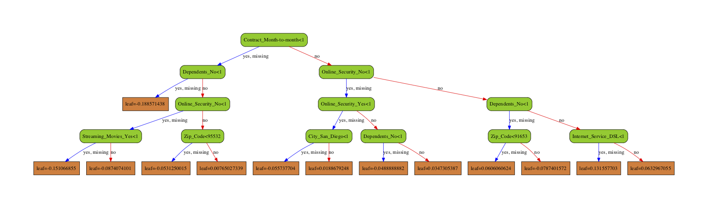

# XGBoost in Python for Customer Churn Prediction

#### Tattwa Darshi Panda, Data Scientist, Hong Kong

----

In this project we use **XGBoost** to build a collection of boosted trees (one of which is illustrated below), and use continuous and categorical data from the **[IBM Base Samples](https://community.ibm.com/community/user/businessanalytics/blogs/steven-macko/2018/09/12/base-samples-for-ibm-cognos-analytics)** to predict whether or not a customer will **[stop using a company's service](https://community.ibm.com/community/user/businessanalytics/blogs/steven-macko/2019/07/11/telco-customer-churn-1113)**. In business lingo, this is called **Customer Churn**. You can download the **[Telco Churn dataset](https://community.ibm.com/community/user/businessanalytics/blogs/steven-macko/2017/06/19/guide-to-ibm-cognos-analytics-sample-data-sets)**, or use the file provided with the jupyter notebook.

<!--  -->

**XGBoost** is an exceptionally useful machine learning method when you don't want to sacrifice the ability to correctly classify observations but you still want a model that is fairly easy to understand and interpret. 

In this project we will do the following:

- **[Importing Data from a File](#download-the-data)**

- **[Missing Data](#identify-and-deal-with-missing-data)**
    - Identifying Missing Data
    - Dealing with Missing Data

- **[Formatting the Data for XGBoost](#format-the-data)**

    - Splitting data into Dependent and Independent Variables
    - One-Hot-Encoding
    - Converting all columns to Int, Float or Bool
    

- **[Building a Preliminary XGBoost Model](#build-tree)**

- **[Optimizing Parameters with Cross Validation and GridSearch()](#optimize-parameters)**
    
    - Optimizing the learning rate, tree depth, number of trees, gamma (for pruning) and lambda (for regularization).

- **[Building, Drawing, Interpreting and Evaluating the Optimized XGBoost Model](#draw-tree)**

# Import the modules that will do all the work
The very first thing we do is load in a bunch of python modules. Python, itself, just gives us a basic programming language. These modules give us extra functionality to import the data, clean it up and format it, and then build, evaluate and draw the **XGBoost** model. 

**NOTE:** You will need **Python 3** and have at least these versions for each of the following modules: 
- pandas >= 1.2.3
- numpy >= 1.19.2
- sklearn >= 0.24.1
- xgboost >= 1.3.3
 
If you installed **Python 3** with [Anaconda](https://www.anaconda.com/), you can check which versions you have with the command: `conda list`. If, for example, your version of `scikit-learn` is older than 0.22.1, then the easiest thing to do is just update all of your **Anaconda** packages with the following command: `conda update --all`. However, if you only want to update `scikit-learn`, then you can run this command: `conda install scikit-learn=0.22.1`.

If you need to install `xgboost`, then you can do so with the following command: `conda install -c conda-forge xgboost`.

**NOTE:** To draw the tree, you will also need to install `graphviz`. You can do that with the command: `conda install graphviz python-graphviz`.
